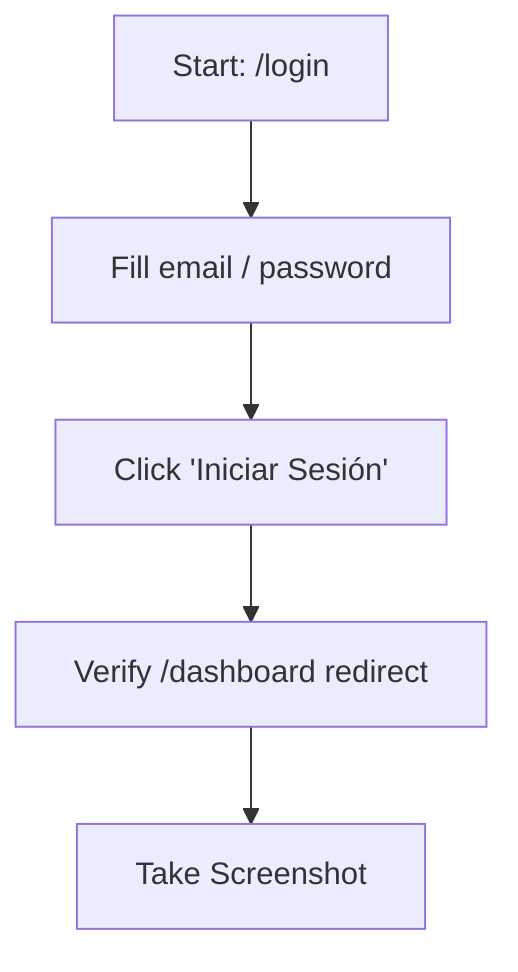

# Web Testing & Browser Automation

This guide establishes the standards, architecture, and recipes for testing the **WashMaster Pro (Stitch)** application. It covers unit testing with **Vitest**, component testing with **React Testing Library**, and E2E / browser automation testing using the **Chrome DevTools MCP plugin**.

---

## 1. E2E Testing via Chrome DevTools (Agentic Testing)

Since the workspace is equipped with Chrome DevTools MCP server (`chrome-devtools` / `chrome-devtools-mcp`), we can execute live E2E tests directly in the browser. 

### Core Action Workflow
Always follow this sequence when automating browser tests:
1. **Initialize Page**: Call `new_page` or `list_pages` to locate/create a browser tab.
2. **Navigate**: Use `navigate_page` to go to the local dev URL (e.g., `http://localhost:3000` or the corresponding dev port).
3. **Observe Console**: Call `get_console_message` to catch any client-side JavaScript or routing errors.
4. **Act**:
   - `type_text` or `fill` to input data.
   - `click` or `press_key` to trigger buttons, selects, or links.
   - `hover` to trigger menus/tooltips.
5. **Verify & Document**:
   - `take_screenshot` to save visual proof of the state to the artifacts directory.
   - `take_snapshot` to read the HTML structure and verify correct text.

### E2E Test Recipes

#### Scenario A: User Login Flow


1. Navigate to `/login`:
   ```json
   { "url": "http://localhost:3000/login" }
   ```
2. Fill credentials:
   ```json
   { "selector": "#email", "value": "darwinjackso.12@gmail.com" }
   { "selector": "#password", "value": "Admin123!" }
   ```
3. Click login button:
   ```json
   { "selector": "button[type='submit']" }
   ```
4. Verify redirection to `/dashboard` by taking a screenshot and saving it.

#### Scenario B: New Order Plate Search & Auto-fill
1. Navigate to `/ordenes/nueva`
2. Input a registered plate number in the `#placa` input (e.g., `ABC-123`).
3. Wait 600ms (to let the debounce complete).
4. Verify:
   - Green success badge is displayed: `CheckCircle2` icon with text "Vehículo registrado".
   - Client fields (`#cNombre`, `#cApellido`, `#cTel`, `#cEmail`) are populated automatically.
   - Vehicle fields (`#marca`, `#modelo`, `#color`) are populated.
5. Take a screenshot to document the auto-filled state:
   ```json
   { "path": "C:/Users/USER/.gemini/antigravity/brain/<conv-id>/order_autofill_success.png" }
   ```

---

## 2. Unit Testing with Vitest

For server actions, calculations, and pure helper functions, use **Vitest** for fast execution and isolation.

### Directory Structure
Keep test files alongside the code they test using the `.test.ts` or `.spec.ts` naming convention:
```
src/
├── lib/
│   ├── actions/
│   │   ├── clientes.ts
│   │   └── __tests__/
│   │       └── clientes.test.ts
│   └── utils/
│       ├── formatters.ts
│       └── __tests__/
│           └── formatters.test.ts
```

### Mocking Drizzle ORM
When testing Server Actions in isolation without writing to the real Supabase DB, mock Drizzle:
```typescript
import { vi, describe, it, expect, beforeEach } from "vitest";
import { buscarVehiculoPorPlaca } from "../clientes";
import { db } from "@/lib/db";

// Mock the DB module
vi.mock("@/lib/db", () => ({
  db: {
    select: vi.fn().mockReturnThis(),
    from: vi.fn().mockReturnThis(),
    innerJoin: vi.fn().mockReturnThis(),
    where: vi.fn().mockReturnThis(),
    limit: vi.fn(),
  },
}));

describe("clientes server actions", () => {
  beforeEach(() => {
    vi.clearAllMocks();
  });

  it("should return vehicle and client info when plate is found", async () => {
    const mockResult = [{
      vehiculoId: "v123",
      placa: "ABC-123",
      tipo: "sedan",
      clienteNombre: "Carlos",
      clienteApellido: "Gómez"
    }];

    // Setup mock resolution
    (db.limit as any).mockResolvedValueOnce(mockResult);

    const result = await buscarVehiculoPorPlaca("ABC-123");
    expect(result).toEqual(mockResult[0]);
  });
});
```

### Mocking Better Auth Sessions
To test protected server actions, mock the session utility `getSessionOrThrow`:
```typescript
vi.mock("../servicios", () => ({
  getSessionOrThrow: vi.fn().mockResolvedValue({
    user: {
      id: "u123",
      name: "Darwin Jackson",
      email: "darwinjackso.12@gmail.com",
      role: "Administrador",
      sucursalId: "s456",
    },
  }),
}));
```

---

## 3. Component Testing with React Testing Library

Use React Testing Library to verify React client component rendering, user interactions, and prop propagation.

### Example: Testing the Wizard Step (PasoVehiculoCliente)
```typescript
import { render, screen, fireEvent, waitFor } from "@testing-library/react";
import { PasoVehiculoCliente } from "../PasoVehiculoCliente";
import { vi, describe, it, expect } from "vitest";

// Mock the server action called in PasoVehiculoCliente
vi.mock("@/lib/actions/clientes", () => ({
  buscarVehiculoPorPlaca: vi.fn().mockResolvedValue({
    tipo: "suv",
    marca: "Toyota",
    modelo: "RAV4",
    color: "Rojo",
    clienteNombre: "María",
    clienteApellido: "Pérez",
    clienteTelefono: "999888777",
    clienteEmail: "maria@correo.com",
  }),
}));

describe("PasoVehiculoCliente Component", () => {
  it("should query the server and autofill on plate change", async () => {
    const setPlaca = vi.fn();
    const setVehiculoTipo = vi.fn();
    const setVehiculoMarca = vi.fn();
    const setClienteNombre = vi.fn();

    render(
      <PasoVehiculoCliente
        placa=""
        setPlaca={setPlaca}
        vehiculoTipo="sedan"
        setVehiculoTipo={setVehiculoTipo}
        vehiculoMarca=""
        setVehiculoMarca={setVehiculoMarca}
        vehiculoModelo=""
        setVehiculoModelo={vi.fn()}
        vehiculoColor=""
        setVehiculoColor={vi.fn()}
        clienteNombre=""
        setClienteNombre={setClienteNombre}
        clienteApellido=""
        setClienteApellido={vi.fn()}
        clienteTelefono=""
        setClienteTelefono={vi.fn()}
        clienteEmail=""
        setClienteEmail={vi.fn()}
        sucursalConfig={{}}
      />
    );

    const input = screen.getByLabelText(/Número de Placa/i);
    fireEvent.change(input, { target: { value: "ABC-123" } });

    // Wait for the debounced search to finish and trigger mock autofill calls
    await waitFor(() => {
      expect(setClienteNombre).toHaveBeenCalledWith("María");
      expect(setVehiculoTipo).toHaveBeenCalledWith("suv");
      expect(setVehiculoMarca).toHaveBeenCalledWith("Toyota");
    });
  });
});
```

---

## 4. Best Practices Checklist

- [ ] **Isolate DB tests**: In integrations tests that run against a real test database, wrap each test run in a transaction and roll it back, or seed fresh schemas beforehand.
- [ ] **Ensure Wait Times in E2E**: React state changes and async API calls take time. Use `wait_for` (or wait periods in tests) rather than assuming instant rendering.
- [ ] **Assert Accessibility (A11y)**: Include `axe-core` tests in E2E scripts to verify color contrast, target size, and label associations.
- [ ] **Test Responsive Breakpoints**: Verify layout changes (e.g. mobile drawer menu vs desktop sidebar) by emulating mobile screen sizes (`emulate` or page resize).
- [ ] **Mock Fetch and APIs**: Avoid calling real payment gateways or transactional SMS APIs. Use environment variable flags to switch to mock adapters.
